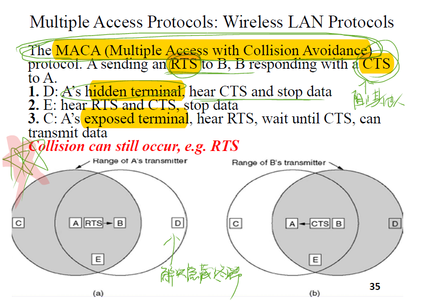
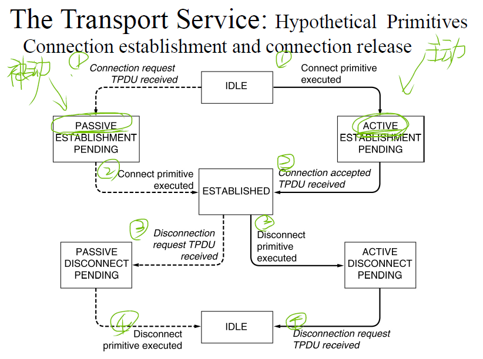

# 笔记

created by laylalaisy

## 1. 简介

- OSI参考模型

以上七道工序最终产生了二进制流，除了物理层之外，每道工序都会在原始数据前添加一串属于自己的协议头，每个协议头有源主机的每层工序产生，自然有理解这些协议头的对端，举例来说：

**链路层协议头**，这个协议头只有*源主机、端接路由器*可以理解，只会存活在源主机与其端接的中继路由器，换句话说，其*生命周期只限于一根链路*，只要端接路由器能顺利接收，其使命就算完成了，那路由器会将其从二进制流剥离掉，剩下打头阵的就是网络层的协议头。

**网络层协议头**，其中*包含了目的地网络地址，用于指示沿途的路由器*，这一串二进制流的目的地是哪里，路由器查询自己的网络地址表，决定再发给更靠近目的地的下一跳路由器。假如找到了一个出接口与下一跳路由器直连，则又要考虑如何添加链路层的协议头了，依据不同的接口类型，添加了适合此链路的链路层协议头，然后再依据物理层介质的不同，物理层将其以光、电、电磁波的信号发送出去。

依照上面类似的步骤，一串二进制流每经过沿途一跳路由器，变换一次链路特有的协议头，但网络层协议头一直不会变，最终这一串二进制流到达了终点。

至此，网络层协议头也完成了其使命，剥离掉网络层协议头，剥离掉之前，先读出网络层协议头的传输层协议代码，把这一串二进制流发给传输层，剩下打头阵的就是传输层的协议头。

**传输层协议**，依据传输层协议头里会话层协议代码，先剥离掉传输层协议头，把这一串二进制流发给会话层，剩下打头阵的就是会话层协议头。

会话层协议，依据会话层议头里表示层协议代码，先剥离掉会话层协议头，把这一串二进制流发给表示层，剩下的头阵的就是表示层协议头。

表示层协议，依据表示层议头里应用层协议代码，先剥离掉表示层协议头，把这一串二进制流发给应用层，剩下的头阵的就是应用层协议头。

**应用层协议**，经过以上一跳一跳路由器的中继、终点主机的一层层协议头的剥离，源主机发给终点主机的数据终于到达终点了，至于*数据是文字、图片、音频、视频，则由应用层协议来最终解释*。

- 本书使用的模型

## 2. 物理层 

## 3. 链路层 +MCA

- 
- 
- 

Hamming: https://blog.csdn.net/coolskyying/article/details/78963550

## 4. 网络层

## 5. 传输层

## 6. 应用层

# 公式

## 2. 物理层

- 

## 3. 链路层 +MCA

## 4. 网络层

## 5. 传输层

## 6. 应用层